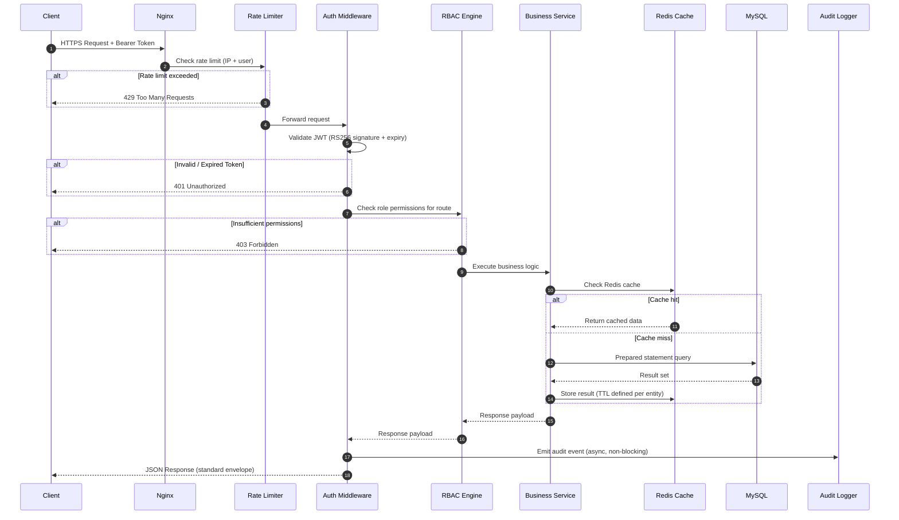
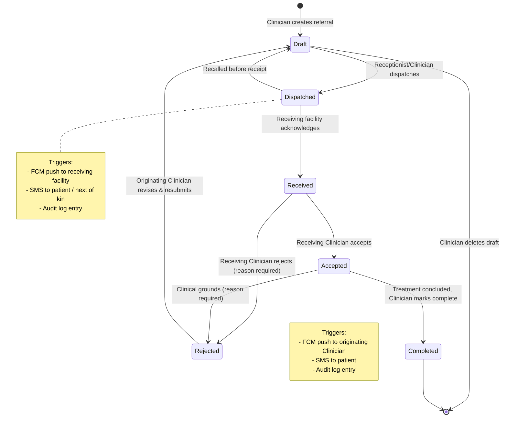
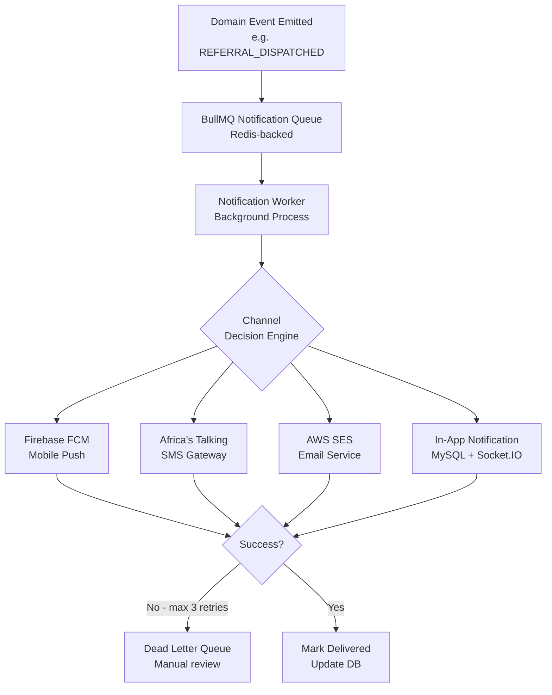
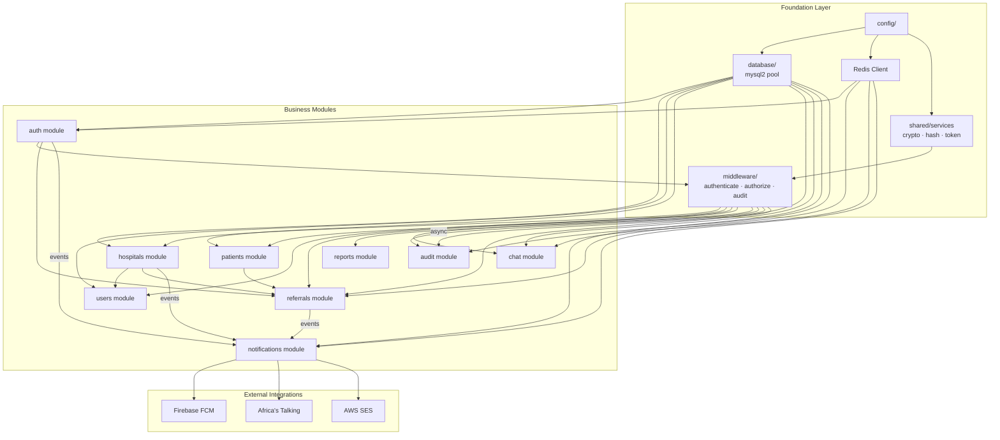
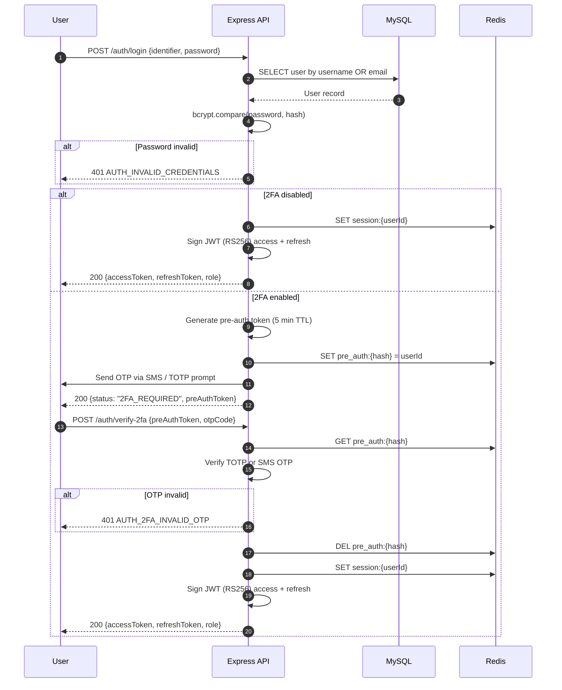
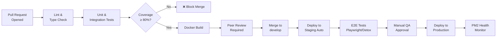
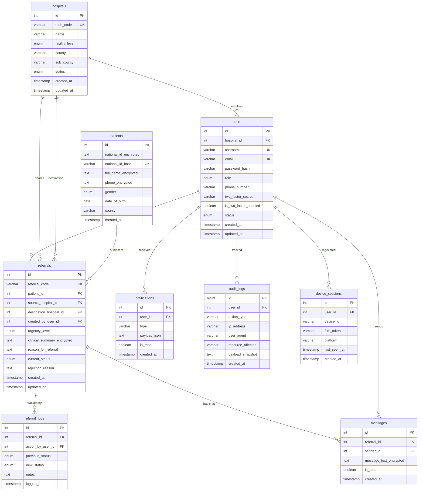
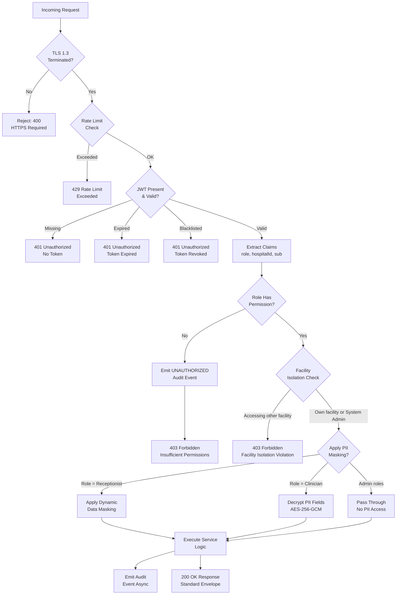

# 🏥 PRMS — Master Architecture Contract
## Patient Referral Management System (Kenya)

**Version:** 1.0.0
**Status:** ✅ APPROVED — Binding on all engineering teams
**Date:** June 10, 2026
**Authority:** Chief Software Architect

---

> ⚠️ **MANDATORY NOTICE**
> This document is the single source of truth for all architectural, naming, API, security, and coding decisions across the PRMS platform.
> Every team — Database, Backend Core, Business Modules, Communication, Web Admin, Mobile, UI/UX, DevOps, and Integration — **MUST** comply with every standard defined herein.
> Any deviation requires written architectural approval before implementation.

---

## TABLE OF CONTENTS

1. [System Identity & Technology Stack](#1-system-identity--technology-stack)
2. [Complete System Architecture](#2-complete-system-architecture)
3. [Monorepo Structure](#3-monorepo-structure)
4. [Service Boundaries](#4-service-boundaries)
5. [Module Dependency Map](#5-module-dependency-map)
6. [Coding Standards](#6-coding-standards)
7. [Naming Conventions](#7-naming-conventions)
8. [API Standards](#8-api-standards)
9. [Database Standards](#9-database-standards)
10. [Security Standards](#10-security-standards)
11. [Frontend Standards — Web Admin](#11-frontend-standards--web-admin)
12. [Mobile Standards — React Native](#12-mobile-standards--react-native)
13. [Integration Standards](#13-integration-standards)
14. [Development Workflow](#14-development-workflow)
15. [Environment & Configuration Standards](#15-environment--configuration-standards)
16. [Mermaid Diagrams Reference](#16-mermaid-diagrams-reference)

---

## 1. SYSTEM IDENTITY & TECHNOLOGY STACK

### 1.1 System Identification

| Field                   | Value                                                              |
|-------------------------|--------------------------------------------------------------------|
| System Name             | Patient Referral Management System (PRMS)                         |
| Target Market           | Republic of Kenya — Public Health Sector                          |
| Regulatory Compliance   | Kenya Data Protection Act (KDPA) 2019, MoH Enterprise Architecture|
| Expected Users          | 100,000+ registered users across 500+ facilities                   |
| Concurrent Sessions     | 10,000 minimum guaranteed                                          |
| Architecture Pattern    | Monorepo, N-Tier, Clean Architecture, Domain-Driven Design (DDD)  |
| API Style               | RESTful JSON over HTTPS (TLS 1.3)                                  |
| Real-time Protocol      | Socket.IO v4 over WSS                                              |

---

### 1.2 Approved Technology Stack

#### Backend
| Concern              | Technology                  | Version  | Rationale                                    |
|----------------------|-----------------------------|----------|----------------------------------------------|
| Runtime              | Node.js                     | 20 LTS   | Long-term support, event-loop concurrency     |
| Framework            | Express.js                  | 4.x      | Minimal, production-proven, ecosystem         |
| Database             | MySQL (InnoDB)              | 8.0      | ACID compliance, FK constraints, Kenya hosting|
| Cache / Broker       | Redis                       | 7.x      | Sessions, pub/sub, rate limiting, queues      |
| Real-time            | Socket.IO                   | 4.x      | Bi-directional, fallback support, scalable    |
| Process Manager      | PM2                         | Latest   | Cluster mode, restart policies, logging       |
| Auth Tokens          | JWT (RS256)                 | —        | Asymmetric; public key can be distributed     |
| Password Hashing     | bcrypt                      | —        | Work factor 12 minimum                        |
| Encryption           | AES-256-GCM (Node `crypto`) | —        | Standard, audited, no external dependency     |
| Validation           | Zod                         | 3.x      | TypeScript-native schema validation           |
| HTTP Client          | Axios                       | 1.x      | External API calls (FCM, Africa's Talking)    |
| DB Driver            | mysql2                      | 3.x      | Raw prepared statements — no ORM              |
| Testing              | Jest + Supertest            | Latest   | Unit + integration                            |
| Documentation        | Swagger / OpenAPI 3.1       | —        | Auto-generated API docs                       |
| Logging              | Winston                     | 3.x      | Structured JSON logs, transport-agnostic      |
| Job Queues           | BullMQ (Redis-backed)       | 5.x      | Notification queues, retry logic              |

#### Web Admin Portal
| Concern              | Technology                  | Version  |
|----------------------|-----------------------------|----------|
| Framework            | React + TypeScript          | 18 / 5.x |
| Build Tool           | Vite                        | 5.x      |
| UI Library           | Material UI (MUI)           | v5       |
| State Management     | Redux Toolkit               | v2       |
| Data Fetching        | TanStack Query (React Query)| v5       |
| Forms                | React Hook Form + Zod       | Latest   |
| Charts               | Recharts                    | 2.x      |
| Routing              | React Router DOM            | v6       |
| Unit Testing         | Vitest + React Testing Lib  | Latest   |
| E2E Testing          | Playwright                  | Latest   |
| Linting              | ESLint + Prettier           | Latest   |

#### Mobile Application
| Concern              | Technology                  | Version  |
|----------------------|-----------------------------|----------|
| Framework            | React Native + TypeScript   | 0.74 / 5.x|
| Navigation           | React Navigation            | v6       |
| State Management     | Redux Toolkit               | v2       |
| Data Fetching        | TanStack Query              | v5       |
| Local DB (Offline)   | WatermelonDB (SQLite)       | Latest   |
| Push Notifications   | Firebase Cloud Messaging    | Latest   |
| Forms                | React Hook Form + Zod       | Latest   |
| Unit Testing         | Jest                        | Latest   |
| E2E Testing          | Detox                       | Latest   |

#### Infrastructure
| Concern              | Technology                  |
|----------------------|-----------------------------|
| Containerization     | Docker + Docker Compose     |
| Reverse Proxy        | Nginx 1.25                  |
| CI/CD                | GitHub Actions              |
| Cloud Provider       | AWS (primary) / Azure       |
| Server OS            | Ubuntu 22.04 LTS            |
| SMS Gateway          | Africa's Talking API        |
| Push Notifications   | Firebase Cloud Messaging    |
| Email                | AWS SES / SMTP              |

---

## 2. COMPLETE SYSTEM ARCHITECTURE

### 2.1 High-Level System Architecture

```
┌─────────────────────────────────────────────────────────────────────────────┐
│                              CLIENT LAYER                                    │
│   ┌──────────────────────────┐              ┌──────────────────────────┐    │
│   │    React Native App       │              │    Web Admin Portal       │    │
│   │  (Clinicians / Receptionists)│          │  (System Admin / Hosp Admin)│   │
│   │  iOS + Android            │              │  React + TypeScript        │    │
│   └────────────┬─────────────┘              └─────────────┬────────────┘    │
└────────────────┼────────────────────────────────────────  ┼  ───────────────┘
                 │ HTTPS (TLS 1.3)                           │ HTTPS (TLS 1.3)
                 └─────────────────────┬─────────────────────┘
                                       │
┌──────────────────────────────────────▼──────────────────────────────────────┐
│                         GATEWAY & PROXY LAYER                                │
│   ┌─────────────────────────────────────────────────────────────────────┐   │
│   │         Nginx Reverse Proxy  (SSL Termination + Rate Limiting)       │   │
│   │                  Load Balancer → Node.js Cluster Nodes               │   │
│   └─────────────────────────────────────────────────────────────────────┘   │
└────────────────────────────────────────────┬────────────────────────────────┘
                                             │
┌────────────────────────────────────────────▼────────────────────────────────┐
│                          APPLICATION LAYER                                   │
│   ┌──────────────┐  ┌───────────┐  ┌──────────┐  ┌────────────────────┐   │
│   │ Auth Service │  │ Hospital  │  │ Patient  │  │  Referral Service   │   │
│   │  (JWT/2FA)   │  │  Service  │  │  Service │  │  (State Machine)    │   │
│   └──────────────┘  └───────────┘  └──────────┘  └────────────────────┘   │
│   ┌──────────────┐  ┌───────────┐  ┌──────────┐  ┌────────────────────┐   │
│   │ Chat Service │  │Notification│  │ Reporting│  │   Audit Service     │   │
│   │ (Socket.IO)  │  │  Service  │  │  Service │  │  (Immutable Logs)   │   │
│   └──────────────┘  └───────────┘  └──────────┘  └────────────────────┘   │
│                                                                              │
│   ┌──────────────────────────────────────────────────────────────────────┐  │
│   │               Shared Middleware Layer                                 │  │
│   │  [JWT Auth] [RBAC Engine] [Rate Limiter] [Audit Logger] [Validator]   │  │
│   └──────────────────────────────────────────────────────────────────────┘  │
└─────────────────────────────────┬───────────────────────┬───────────────────┘
                                  │                       │
           ┌──────────────────────▼───────┐  ┌───────────▼──────────────────┐
           │          DATA LAYER           │  │     EXTERNAL SERVICES         │
           │  ┌────────────────────────┐  │  │  ┌──────────────────────────┐│
           │  │  MySQL 8.0 Primary     │  │  │  │ Firebase FCM (Push)       ││
           │  │  + Read Replicas       │  │  │  └──────────────────────────┘│
           │  └────────────────────────┘  │  │  ┌──────────────────────────┐│
           │  ┌────────────────────────┐  │  │  │ Africa's Talking (SMS)    ││
           │  │  Redis 7.x             │  │  │  └──────────────────────────┘│
           │  │  Cache + Pub/Sub       │  │  │  ┌──────────────────────────┐│
           │  │  + BullMQ Queues       │  │  │  │ AWS SES / SMTP (Email)    ││
           │  └────────────────────────┘  │  │  └──────────────────────────┘│
           └──────────────────────────────┘  └──────────────────────────────┘
```

### 2.2 Authentication & Request Flow (Mermaid Sequence)



### 2.3 Referral Lifecycle State Machine



### 2.4 Notification Flow Architecture



---

## 3. MONOREPO STRUCTURE

### 3.1 Root Workspace Layout

```
kenya-prms/
│
├── .github/                          # GitHub Actions CI/CD pipelines
│   └── workflows/
│       ├── backend-ci.yml
│       ├── web-admin-ci.yml
│       ├── mobile-ci.yml
│       └── deploy-production.yml
│
├── backend/                          # Node.js + Express API Server
├── web-admin/                        # React + TypeScript Admin Portal
├── mobile/                           # React Native Mobile Application
├── shared/                           # Cross-platform shared types & utilities
│   ├── types/                        # TypeScript interfaces shared across apps
│   │   ├── user.types.ts
│   │   ├── hospital.types.ts
│   │   ├── patient.types.ts
│   │   ├── referral.types.ts
│   │   └── notification.types.ts
│   ├── constants/                    # Shared enums and constants
│   │   ├── roles.constants.ts
│   │   ├── referral-status.constants.ts
│   │   └── error-codes.constants.ts
│   └── validators/                   # Shared Zod schemas
│       ├── auth.schema.ts
│       ├── hospital.schema.ts
│       ├── patient.schema.ts
│       └── referral.schema.ts
│
├── docs/                             # Architecture and API documentation
│   ├── architecture/
│   │   └── PRMS_Architecture_Contract_v1.0.md   ← this file
│   ├── api/
│   │   └── openapi.yaml
│   └── diagrams/
│
├── scripts/                          # Monorepo utility scripts
│   ├── setup.sh
│   ├── seed-database.sh
│   └── generate-keys.sh
│
├── docker-compose.yml                # Full stack local development
├── docker-compose.prod.yml           # Production compose override
├── .env.example                      # Master env template (no secrets)
├── .gitignore
├── package.json                      # Monorepo root (Yarn Workspaces)
└── README.md
```

### 3.2 Backend Structure (Detailed)

```
backend/
│
├── src/
│   ├── config/                       # All configuration loaders
│   │   ├── database.config.ts        # MySQL pool configuration
│   │   ├── redis.config.ts           # Redis client configuration
│   │   ├── jwt.config.ts             # JWT keys and settings
│   │   ├── encryption.config.ts      # AES-256-GCM key setup
│   │   ├── server.config.ts          # Express + Socket.IO setup
│   │   └── logger.config.ts          # Winston logger configuration
│   │
│   ├── modules/                      # Feature modules (DDD bounded contexts)
│   │   ├── auth/
│   │   │   ├── auth.controller.ts
│   │   │   ├── auth.service.ts
│   │   │   ├── auth.repository.ts
│   │   │   ├── auth.routes.ts
│   │   │   ├── auth.validator.ts
│   │   │   └── auth.test.ts
│   │   ├── hospitals/
│   │   │   ├── hospitals.controller.ts
│   │   │   ├── hospitals.service.ts
│   │   │   ├── hospitals.repository.ts
│   │   │   ├── hospitals.routes.ts
│   │   │   ├── hospitals.validator.ts
│   │   │   └── hospitals.test.ts
│   │   ├── users/
│   │   │   └── [same pattern]
│   │   ├── patients/
│   │   │   └── [same pattern]
│   │   ├── referrals/
│   │   │   ├── referrals.controller.ts
│   │   │   ├── referrals.service.ts
│   │   │   ├── referrals.repository.ts
│   │   │   ├── referrals.routes.ts
│   │   │   ├── referrals.validator.ts
│   │   │   ├── referrals.state-machine.ts  ← Status transitions
│   │   │   └── referrals.test.ts
│   │   ├── chat/
│   │   │   ├── chat.gateway.ts             ← Socket.IO event handlers
│   │   │   ├── chat.service.ts
│   │   │   ├── chat.repository.ts
│   │   │   └── chat.test.ts
│   │   ├── notifications/
│   │   │   ├── notifications.service.ts
│   │   │   ├── notifications.queue.ts      ← BullMQ queue definitions
│   │   │   ├── notifications.worker.ts     ← BullMQ processors
│   │   │   ├── notifications.repository.ts
│   │   │   ├── channels/
│   │   │   │   ├── fcm.channel.ts
│   │   │   │   ├── sms.channel.ts
│   │   │   │   └── email.channel.ts
│   │   │   └── templates/
│   │   │       ├── referral-dispatched.template.ts
│   │   │       ├── referral-accepted.template.ts
│   │   │       └── password-reset.template.ts
│   │   ├── reports/
│   │   │   ├── reports.controller.ts
│   │   │   ├── reports.service.ts
│   │   │   ├── reports.repository.ts
│   │   │   └── reports.routes.ts
│   │   └── audit/
│   │       ├── audit.service.ts
│   │       ├── audit.repository.ts
│   │       └── audit.routes.ts
│   │
│   ├── middleware/                   # Express middleware (applied globally or per-route)
│   │   ├── authenticate.middleware.ts    ← JWT validation
│   │   ├── authorize.middleware.ts       ← RBAC permission check
│   │   ├── audit.middleware.ts           ← Automatic audit trail
│   │   ├── rate-limit.middleware.ts      ← Redis-backed rate limiting
│   │   ├── validate.middleware.ts        ← Zod schema validation
│   │   ├── error-handler.middleware.ts   ← Global error handler
│   │   └── request-id.middleware.ts      ← UUID per request
│   │
│   ├── shared/                       # Internal backend shared utilities
│   │   ├── crypto.service.ts         ← AES-256-GCM encrypt/decrypt
│   │   ├── hash.service.ts           ← Deterministic HMAC-SHA256
│   │   ├── token.service.ts          ← JWT issue / refresh / revoke
│   │   ├── response.helper.ts        ← Standard response builder
│   │   ├── pagination.helper.ts      ← Pagination parser
│   │   └── errors/
│   │       ├── app.error.ts          ← Base AppError class
│   │       ├── auth.error.ts
│   │       ├── validation.error.ts
│   │       ├── not-found.error.ts
│   │       └── forbidden.error.ts
│   │
│   ├── database/
│   │   ├── migrations/               ← Sequential SQL migration files
│   │   │   ├── 001_create_hospitals.sql
│   │   │   ├── 002_create_users.sql
│   │   │   ├── 003_create_patients.sql
│   │   │   ├── 004_create_referrals.sql
│   │   │   ├── 005_create_referral_logs.sql
│   │   │   ├── 006_create_messages.sql
│   │   │   ├── 007_create_notifications.sql
│   │   │   └── 008_create_audit_logs.sql
│   │   ├── seeds/                    ← Development seed data
│   │   │   ├── hospitals.seed.ts
│   │   │   └── users.seed.ts
│   │   └── connection.ts             ← mysql2 pool export
│   │
│   └── app.ts                        ← Express app factory (no listen call)
│
├── server.ts                         ← Entry point (createServer + listen)
├── jest.config.ts
├── tsconfig.json
├── .eslintrc.json
├── .env.example
├── package.json
└── Dockerfile
```

### 3.3 Web Admin Structure (Detailed)

```
web-admin/
│
├── public/
│   └── favicon.ico
│
├── src/
│   ├── app/
│   │   ├── App.tsx                   ← Root component, providers, router
│   │   ├── router.tsx                ← All route definitions
│   │   └── store.ts                  ← Redux store configuration
│   │
│   ├── features/                     ← Feature-based folder (mirrors backend modules)
│   │   ├── auth/
│   │   │   ├── components/
│   │   │   │   ├── LoginForm.tsx
│   │   │   │   └── TwoFactorForm.tsx
│   │   │   ├── pages/
│   │   │   │   └── LoginPage.tsx
│   │   │   ├── hooks/
│   │   │   │   └── useAuth.ts
│   │   │   ├── services/
│   │   │   │   └── auth.api.ts       ← React Query + Axios calls
│   │   │   └── store/
│   │   │       └── auth.slice.ts
│   │   ├── dashboard/
│   │   ├── hospitals/
│   │   ├── users/
│   │   ├── patients/
│   │   ├── referrals/
│   │   ├── reports/
│   │   └── audit-logs/
│   │
│   ├── shared/                       ← Reusable UI building blocks
│   │   ├── components/
│   │   │   ├── layout/
│   │   │   │   ├── AppShell.tsx
│   │   │   │   ├── Sidebar.tsx
│   │   │   │   └── TopBar.tsx
│   │   │   ├── ui/
│   │   │   │   ├── DataTable.tsx
│   │   │   │   ├── StatusBadge.tsx
│   │   │   │   ├── ConfirmDialog.tsx
│   │   │   │   ├── PageHeader.tsx
│   │   │   │   └── LoadingSpinner.tsx
│   │   │   └── forms/
│   │   │       ├── FormTextField.tsx
│   │   │       ├── FormSelect.tsx
│   │   │       └── FormDatePicker.tsx
│   │   ├── hooks/
│   │   │   ├── useDebounce.ts
│   │   │   ├── usePagination.ts
│   │   │   └── usePermissions.ts
│   │   ├── utils/
│   │   │   ├── api-client.ts         ← Axios instance with interceptors
│   │   │   ├── format.utils.ts
│   │   │   └── date.utils.ts
│   │   └── constants/
│   │       └── routes.constants.ts
│   │
│   ├── theme/
│   │   ├── theme.ts                  ← MUI theme override
│   │   ├── colors.ts
│   │   └── typography.ts
│   │
│   └── types/
│       └── index.ts                  ← Re-exports from shared/types
│
├── tests/
│   ├── unit/
│   └── e2e/
│
├── vite.config.ts
├── tsconfig.json
├── .eslintrc.json
└── package.json
```

### 3.4 Mobile Structure (Detailed)

```
mobile/
│
├── android/
├── ios/
│
├── src/
│   ├── app/
│   │   ├── App.tsx
│   │   └── store.ts
│   │
│   ├── navigation/
│   │   ├── RootNavigator.tsx         ← Auth vs Authenticated switch
│   │   ├── AuthNavigator.tsx         ← Login, 2FA
│   │   ├── ClinicianNavigator.tsx    ← Bottom tabs for Clinician
│   │   ├── ReceptionistNavigator.tsx ← Bottom tabs for Receptionist
│   │   └── types.ts                  ← Navigation param types
│   │
│   ├── features/
│   │   ├── auth/
│   │   │   ├── screens/
│   │   │   │   ├── LoginScreen.tsx
│   │   │   │   └── TwoFactorScreen.tsx
│   │   │   ├── hooks/
│   │   │   └── store/
│   │   ├── dashboard/
│   │   ├── patients/
│   │   │   └── screens/
│   │   │       ├── PatientRegistrationScreen.tsx
│   │   │       └── PatientSearchScreen.tsx
│   │   ├── referrals/
│   │   │   └── screens/
│   │   │       ├── ReferralListScreen.tsx
│   │   │       ├── ReferralDetailScreen.tsx
│   │   │       ├── CreateReferralScreen.tsx
│   │   │       └── ReferralTimelineScreen.tsx
│   │   ├── chat/
│   │   │   └── screens/
│   │   │       └── ReferralChatScreen.tsx
│   │   └── notifications/
│   │
│   ├── shared/
│   │   ├── components/
│   │   │   ├── ui/
│   │   │   │   ├── AppButton.tsx
│   │   │   │   ├── AppInput.tsx
│   │   │   │   ├── StatusBadge.tsx
│   │   │   │   └── LoadingOverlay.tsx
│   │   │   └── layout/
│   │   │       └── ScreenWrapper.tsx
│   │   ├── hooks/
│   │   │   ├── useNetworkStatus.ts
│   │   │   └── usePermissions.ts
│   │   └── utils/
│   │       ├── api-client.ts
│   │       └── storage.utils.ts
│   │
│   ├── database/                     ← WatermelonDB offline schema
│   │   ├── schema.ts
│   │   ├── migrations.ts
│   │   └── models/
│   │       ├── ReferralModel.ts
│   │       └── PatientModel.ts
│   │
│   ├── sync/                         ← Offline sync engine
│   │   ├── sync.service.ts
│   │   ├── sync.queue.ts
│   │   └── conflict-resolver.ts
│   │
│   └── theme/
│       ├── colors.ts
│       ├── spacing.ts
│       └── typography.ts
│
├── jest.config.ts
├── tsconfig.json
└── package.json
```

---

## 4. SERVICE BOUNDARIES

Each service owns its data and exposes contracts. **No service may directly query another service's database tables.**

### 4.1 Service Ownership Matrix

| Service            | Owns Tables                                      | Exposes Events                           | Consumes Events                          |
|--------------------|--------------------------------------------------|------------------------------------------|------------------------------------------|
| **Auth Service**   | `users`, `refresh_tokens`, `device_sessions`     | `USER_LOGGED_IN`, `USER_LOGGED_OUT`      | None                                     |
| **Hospital Service**| `hospitals`, `hospital_approvals`               | `HOSPITAL_APPROVED`, `HOSPITAL_SUSPENDED`| `USER_LOGGED_IN` (session invalidation)  |
| **Patient Service**| `patients`                                      | `PATIENT_REGISTERED`                     | None                                     |
| **Referral Service**| `referrals`, `referral_logs`, `referral_attachments`| `REFERRAL_DISPATCHED`, `REFERRAL_ACCEPTED`, `REFERRAL_REJECTED`, `REFERRAL_COMPLETED` | `PATIENT_REGISTERED`, `HOSPITAL_APPROVED` |
| **Chat Service**   | `messages`, `message_read_receipts`              | `MESSAGE_SENT`                           | `REFERRAL_ACCEPTED` (open chat channel)  |
| **Notification Service** | `notifications`, `notification_logs`       | None                                     | All domain events                        |
| **Audit Service**  | `audit_logs`                                     | None                                     | All domain events + HTTP middleware      |
| **Report Service** | Read-only access to all tables (via views/replicas)| None                                  | None                                     |

### 4.2 Inter-Service Communication Rules

- **Synchronous (same process):** Services within the same Node.js process communicate via direct function calls through service interfaces. No HTTP between internal modules.
- **Asynchronous (cross-concern):** Domain events are published to Redis Pub/Sub and consumed by Notification and Audit services.
- **No circular dependencies:** Auth → nobody; Referral → Patient, Hospital; Notification → nobody (consumer only).

### 4.3 Service Dependency Tree

```
Auth Service
  └── depends on: none (foundational)

Hospital Service
  └── depends on: Auth Service (user validation)

User Service
  └── depends on: Auth Service, Hospital Service

Patient Service
  └── depends on: Auth Service, Hospital Service (facility scoping)

Referral Service
  └── depends on: Patient Service, Hospital Service, Auth Service

Chat Service
  └── depends on: Referral Service (channel per referral), Auth Service

Notification Service
  └── depends on: [consumes events from all services above]

Audit Service
  └── depends on: [receives middleware events from all HTTP requests]

Report Service
  └── depends on: [read-only access to all finalized data]
```

---

## 5. MODULE DEPENDENCY MAP



---

## 6. CODING STANDARDS

### 6.1 Language Standards

| Rule                        | Standard                                                    |
|-----------------------------|-------------------------------------------------------------|
| Backend language            | TypeScript 5.x (strict mode ON, no `any` except justified)  |
| Web Admin language          | TypeScript 5.x (strict mode ON)                             |
| Mobile language             | TypeScript 5.x (strict mode ON)                             |
| ECMAScript target           | ES2022 (Node.js 20 supports natively)                       |
| Module system               | ESM everywhere (`"type": "module"` in package.json)        |
| Async style                 | `async/await` — no raw `.then()/.catch()` chains            |
| Error propagation           | `throw new AppError(...)` — never return error objects      |
| `null` vs `undefined`       | Use `null` for intentional absence; `undefined` for missing |
| Type assertions             | Banned — use type guards or Zod parsing                     |

### 6.2 File Organization Rules

- One class/function-group per file
- Maximum file length: 400 lines. If exceeded, extract to sub-modules.
- Import order: external packages → internal modules → relative imports (enforced by ESLint)
- No barrel `index.ts` re-exports in backend modules (creates circular dep risk)
- One `index.ts` barrel allowed per `shared/` folder

### 6.3 Error Handling Standards

All errors thrown in services must extend `AppError`:

```
AppError (base)
├── ValidationError    (HTTP 400)
├── AuthError          (HTTP 401)
├── ForbiddenError     (HTTP 403)
├── NotFoundError      (HTTP 404)
├── ConflictError      (HTTP 409)
├── EncryptionError    (HTTP 500 — logged as CRITICAL)
└── ExternalServiceError (HTTP 503)
```

Global error handler middleware catches all thrown errors and transforms to standard API response.

### 6.4 Logging Standards

All logs use Winston with JSON format and these standard fields:

```json
{
  "timestamp": "2026-06-10T10:00:00.000Z",
  "level": "info | warn | error | debug",
  "requestId": "uuid-v4",
  "userId": 123,
  "module": "referrals",
  "action": "CREATE_REFERRAL",
  "message": "Human readable message",
  "meta": {}
}
```

Log levels:
- `error` — Unhandled exceptions, encryption failures, DB connection loss
- `warn` — Business rule violations, failed 2FA attempts, deprecated usage
- `info` — Successful mutations (create/update/delete), auth events
- `debug` — Queries, cache hits/misses (disabled in production)

### 6.5 Comment Standards

- Public functions: JSDoc comments mandatory
- Private/internal functions: inline comments for non-obvious logic only
- No commented-out code in main branch
- TODO format: `// TODO(assignee): description — JIRA-123`

---

## 7. NAMING CONVENTIONS

### 7.1 Universal Rules (apply across all platforms)

| Entity                       | Convention        | Example                                      |
|------------------------------|-------------------|----------------------------------------------|
| Files (backend)              | `kebab-case`      | `auth.controller.ts`, `crypto.service.ts`    |
| Files (React components)     | `PascalCase`      | `HospitalTable.tsx`, `StatusBadge.tsx`       |
| Files (React hooks)          | `camelCase`       | `useAuth.ts`, `usePagination.ts`             |
| Directories                  | `kebab-case`      | `web-admin/`, `audit-logs/`                  |
| TypeScript interfaces        | `PascalCase` + `I`| `IUser`, `IHospital`, `IReferral`            |
| TypeScript types             | `PascalCase` + `T`| `TUserRole`, `TReferralStatus`               |
| TypeScript enums             | `PascalCase`      | `UserRole`, `ReferralStatus`, `FacilityLevel`|
| Constants                    | `UPPER_SNAKE_CASE`| `JWT_EXPIRY`, `MAX_RETRY_ATTEMPTS`           |
| Functions / methods          | `camelCase`       | `createReferral()`, `encryptField()`         |
| Classes                      | `PascalCase`      | `ReferralService`, `HospitalRepository`      |
| React components             | `PascalCase`      | `ReferralDetailCard`, `HospitalForm`         |
| React hooks                  | `use` prefix      | `useReferralList()`, `useHospitalSearch()`   |
| Redux slices                 | `camelCase`       | `authSlice`, `referralSlice`                 |
| Redux actions                | `camelCase`       | `setAuthUser`, `clearReferralCache`          |
| Redux selectors              | `select` prefix   | `selectCurrentUser`, `selectReferralById`    |
| Event names (Pub/Sub)        | `UPPER_SNAKE_CASE`| `REFERRAL_DISPATCHED`, `HOSPITAL_APPROVED`   |
| Environment variables        | `UPPER_SNAKE_CASE`| `DB_HOST`, `JWT_PRIVATE_KEY`                 |

### 7.2 Database Naming Conventions

| Entity                  | Convention              | Example                                    |
|-------------------------|-------------------------|--------------------------------------------|
| Table names             | `snake_case` plural     | `hospitals`, `referral_logs`, `audit_logs` |
| Column names            | `snake_case`            | `created_at`, `hospital_id`, `moh_code`    |
| Primary keys            | Always `id`             | `id INT AUTO_INCREMENT PRIMARY KEY`        |
| Foreign keys (column)   | `{table_singular}_id`   | `hospital_id`, `patient_id`, `created_by_user_id` |
| Foreign key constraints | `fk_{table}_{ref}`      | `fk_users_hospitals`                       |
| Index names             | `idx_{table}_{columns}` | `idx_referrals_status`, `idx_users_email`  |
| Unique constraint       | `uq_{table}_{column}`   | `uq_users_username`, `uq_hospitals_moh_code`|
| Boolean columns         | `is_` prefix            | `is_active`, `is_two_factor_enabled`       |
| Timestamp columns       | `_at` suffix            | `created_at`, `updated_at`, `deleted_at`   |
| Status columns          | `status` or `_status`   | `status`, `current_status`                 |
| Encrypted columns       | `_encrypted` suffix     | `national_id_encrypted`, `full_name_encrypted`|
| Hash columns            | `_hash` suffix          | `national_id_hash`                         |

### 7.3 API Endpoint Naming

| Rule                        | Standard                                      | Example                                     |
|-----------------------------|-----------------------------------------------|---------------------------------------------|
| Base path                   | `/api/v1/`                                   | All endpoints start here                    |
| Resource names              | `kebab-case` plural nouns                    | `/hospitals`, `/referral-logs`              |
| Sub-resources               | Nested with parent ID                        | `/referrals/:referralId/messages`           |
| Actions (non-CRUD)          | POST with action noun                        | `/hospitals/:id/approve`, `/auth/verify-2fa`|
| IDs in path                 | camelCase param name                         | `:referralId`, `:hospitalId`                |
| Filtering                   | Query string `?key=value`                    | `?status=Approved&county=Nairobi`           |
| Pagination                  | `?page=1&limit=20&sortBy=created_at`         |                                             |
| Search                      | `?q=searchterm`                              |                                             |

---

## 8. API STANDARDS

### 8.1 Standard Response Envelope

**All API responses — success and error — MUST use this envelope. No exceptions.**

#### Success Response
```json
{
  "success": true,
  "data": {},
  "message": "Operation completed successfully",
  "meta": {
    "timestamp": "2026-06-10T10:00:00.000Z",
    "requestId": "550e8400-e29b-41d4-a716-446655440000"
  }
}
```

#### Paginated Success Response
```json
{
  "success": true,
  "data": [],
  "message": "Records retrieved",
  "meta": {
    "timestamp": "2026-06-10T10:00:00.000Z",
    "requestId": "uuid",
    "pagination": {
      "page": 1,
      "limit": 20,
      "total": 150,
      "totalPages": 8,
      "hasNext": true,
      "hasPrev": false
    }
  }
}
```

#### Error Response
```json
{
  "success": false,
  "error": {
    "code": "VALIDATION_ERROR",
    "message": "Validation failed for request body",
    "details": [
      {
        "field": "urgencyLevel",
        "message": "Must be one of: Routine, Urgent, Emergent"
      }
    ]
  },
  "meta": {
    "timestamp": "2026-06-10T10:00:00.000Z",
    "requestId": "uuid"
  }
}
```

### 8.2 HTTP Status Code Allocation

| Status | Use Case                                                      |
|--------|---------------------------------------------------------------|
| `200`  | Successful GET, PATCH, PUT (returns updated resource)         |
| `201`  | Successful POST (resource created)                            |
| `204`  | Successful DELETE (no body)                                   |
| `400`  | Validation failure (Zod parse error)                          |
| `401`  | Missing, expired, or malformed JWT                            |
| `403`  | Valid JWT, but role lacks permission for this resource        |
| `404`  | Resource not found                                            |
| `409`  | Duplicate resource (email, username, moh_code)               |
| `422`  | Valid format but business rule violation (e.g. wrong state)   |
| `429`  | Rate limit exceeded                                           |
| `500`  | Unhandled server exception                                    |
| `503`  | External service unavailable (FCM, Africa's Talking, SMTP)    |

### 8.3 Approved Error Codes

All teams must use these codes in the `error.code` field. No inventing new codes without architectural approval.

```
AUTH_INVALID_CREDENTIALS
AUTH_TOKEN_EXPIRED
AUTH_TOKEN_INVALID
AUTH_REFRESH_TOKEN_EXPIRED
AUTH_2FA_REQUIRED
AUTH_2FA_INVALID_OTP
AUTH_ACCOUNT_SUSPENDED
AUTH_ACCOUNT_INACTIVE
AUTH_INSUFFICIENT_PERMISSIONS
AUTH_HOSPITAL_SUSPENDED

VALIDATION_ERROR
VALIDATION_REQUIRED_FIELD
VALIDATION_INVALID_FORMAT

RESOURCE_NOT_FOUND
RESOURCE_ALREADY_EXISTS
RESOURCE_SUSPENDED
RESOURCE_INVALID_STATE_TRANSITION

ENCRYPTION_FAILURE
DECRYPTION_FAILURE
HASH_FAILURE

EXTERNAL_SERVICE_FCM_UNAVAILABLE
EXTERNAL_SERVICE_SMS_UNAVAILABLE
EXTERNAL_SERVICE_EMAIL_UNAVAILABLE

RATE_LIMIT_EXCEEDED
DATABASE_CONNECTION_ERROR
INTERNAL_SERVER_ERROR
```

### 8.4 Authentication Headers

Every protected endpoint requires:
```
Authorization: Bearer <access_token>
Content-Type: application/json
X-Request-ID: <uuid-v4>       (generated by client, echoed in response)
```

WebSocket handshake:
```javascript
// Client sends auth in handshake
const socket = io('/chat', {
  auth: { token: accessToken },
  transports: ['websocket', 'polling']
});
```

### 8.5 Versioning Policy

- Current version: `v1` — path prefix `/api/v1/`
- Breaking changes require a new version `/api/v2/`
- Old versions supported for minimum 6 months after new version release
- Version in path, not header

### 8.6 Rate Limiting Rules

| Endpoint Group               | Limit              | Window   |
|------------------------------|--------------------|----------|
| `POST /auth/login`           | 5 attempts         | 15 min   |
| `POST /auth/verify-2fa`      | 3 attempts         | 5 min    |
| `POST /auth/forgot-password` | 3 attempts         | 60 min   |
| All other authenticated APIs | 200 requests       | 1 min    |
| Report generation endpoints  | 10 requests        | 1 min    |

### 8.7 Complete Endpoint Registry

| Method | Endpoint                                    | Auth Role                    | Description                    |
|--------|---------------------------------------------|------------------------------|--------------------------------|
| POST   | `/api/v1/auth/login`                        | Public                       | Login with username or email   |
| POST   | `/api/v1/auth/verify-2fa`                   | Pre-auth token               | Verify TOTP or SMS OTP         |
| POST   | `/api/v1/auth/refresh`                      | Refresh token                | Get new access token           |
| POST   | `/api/v1/auth/logout`                       | Any authenticated            | Revoke tokens                  |
| POST   | `/api/v1/auth/forgot-password`              | Public                       | Initiate password reset        |
| POST   | `/api/v1/auth/reset-password`               | Reset token                  | Complete password reset        |
| GET    | `/api/v1/auth/me`                           | Any authenticated            | Get current user profile       |
| POST   | `/api/v1/hospitals`                         | Public                       | Register hospital (pending)    |
| GET    | `/api/v1/hospitals`                         | System Admin                 | List all hospitals             |
| GET    | `/api/v1/hospitals/:hospitalId`             | System Admin, Hospital Admin | Get hospital details           |
| PATCH  | `/api/v1/hospitals/:hospitalId/status`      | System Admin                 | Approve/Suspend hospital       |
| GET    | `/api/v1/users`                             | Hospital Admin               | List facility users            |
| POST   | `/api/v1/users`                             | Hospital Admin               | Create user in facility        |
| GET    | `/api/v1/users/:userId`                     | Hospital Admin               | Get user details               |
| PATCH  | `/api/v1/users/:userId`                     | Hospital Admin               | Update user                    |
| PATCH  | `/api/v1/users/:userId/status`              | Hospital Admin               | Activate/Suspend user          |
| POST   | `/api/v1/patients`                          | Clinician, Receptionist      | Register patient               |
| GET    | `/api/v1/patients`                          | Clinician, Receptionist      | Search patients                |
| GET    | `/api/v1/patients/:patientId`               | Clinician, Receptionist      | Get patient (masked by role)   |
| POST   | `/api/v1/referrals`                         | Clinician                    | Create referral (Draft)        |
| GET    | `/api/v1/referrals`                         | Clinician, Receptionist      | List referrals (scoped)        |
| GET    | `/api/v1/referrals/:referralId`             | Clinician, Receptionist      | Get referral details           |
| PATCH  | `/api/v1/referrals/:referralId/status`      | Clinician, Receptionist      | Transition referral status     |
| GET    | `/api/v1/referrals/:referralId/messages`    | Clinician                    | Get referral chat messages     |
| GET    | `/api/v1/notifications`                     | Any authenticated            | List user notifications        |
| PATCH  | `/api/v1/notifications/:id/read`            | Any authenticated            | Mark notification read         |
| GET    | `/api/v1/reports/county`                    | System Admin, Hospital Admin | County analytics               |
| GET    | `/api/v1/reports/referral-trends`           | System Admin, Hospital Admin | Trend analytics                |
| GET    | `/api/v1/reports/facility-performance`      | System Admin, Hospital Admin | Facility metrics               |
| GET    | `/api/v1/audit-logs`                        | System Admin                 | View audit trail               |

---

## 9. DATABASE STANDARDS

### 9.1 Connection & Pool Configuration

```
Pool minimum connections:  10
Pool maximum connections:  50
Connection timeout:        10 000ms
Acquire timeout:           30 000ms
Idle timeout:              600 000ms
```

### 9.2 Query Standards

- **All queries use prepared statements** — zero string interpolation
- **No ORM** — `mysql2` with `execute()` for prepared statements
- Queries live in Repository classes — no SQL in Controllers or Services
- Maximum query complexity: if a query joins more than 4 tables, extract to a VIEW
- Transactions required for all multi-step mutations
- Read operations on hot-path should target read replicas

### 9.3 Migration Standards

- Files named: `{NNN}_{verb}_{description}.sql` — e.g. `001_create_hospitals.sql`
- Migrations are sequential and irreversible (no DOWN migrations in production)
- Every migration includes a rollback comment for manual use if needed
- Migrations run via a dedicated migration script tracked in `migration_history` table
- Never alter production schema outside of migration files

### 9.4 Index Strategy

| Scenario                       | Index Type           |
|--------------------------------|----------------------|
| Primary key lookups            | Clustered (default)  |
| Foreign key columns            | Index always         |
| Status filter columns          | Non-clustered index  |
| Encrypted data hash lookups    | Unique index on hash |
| Full-text search (names)       | Prohibited — use hash|
| Composite filters (county+date)| Composite index      |
| Report aggregation columns     | Covered index        |

### 9.5 Encryption Field Standards

| Concern                     | Implementation                                      |
|-----------------------------|-----------------------------------------------------|
| Encryption algorithm        | AES-256-GCM                                         |
| Key storage                 | Environment variable `DATABASE_ENCRYPTION_KEY` (hex)|
| Key length                  | 256-bit (32 bytes)                                  |
| IV                          | 12 bytes random per encryption operation            |
| Auth tag                    | 16 bytes, stored with ciphertext                    |
| Stored format               | JSON: `{"iv":"hex","authTag":"hex","content":"hex"}`|
| Column type                 | `TEXT` (stored as JSON string)                      |
| Search on encrypted fields  | HMAC-SHA256 hash in separate `_hash` column         |
| Hash key                    | Environment variable `HASH_SALT` (separate from encryption key)|

### 9.6 Redis Key Naming Standards

| Key Pattern                              | TTL        | Purpose                           |
|------------------------------------------|------------|-----------------------------------|
| `session:{userId}:{deviceId}`            | 15 min     | JWT active session registry       |
| `refresh:{jti}`                          | 7 days     | Refresh token registry            |
| `pre_auth:{token_hash}`                  | 5 min      | 2FA pending state                 |
| `rate_limit:{endpoint}:{ip}`             | 15 min     | Rate limit counter                |
| `cache:hospital:{id}`                    | 5 min      | Hospital entity cache             |
| `cache:hospitals:list:{page}:{filters}`  | 2 min      | Hospital list cache               |
| `cache:referral:{id}`                    | 1 min      | Referral entity cache             |
| `pubsub:referral:{id}:chat`              | —          | Socket.IO chat room key           |
| `notif:queue:fcm`                        | —          | BullMQ FCM queue                  |
| `notif:queue:sms`                        | —          | BullMQ SMS queue                  |
| `blacklist:token:{jti}`                  | Until exp  | Revoked JWT blacklist             |

---

## 10. SECURITY STANDARDS

### 10.1 Authentication Architecture



### 10.2 JWT Specification

| Claim          | Value                                                            |
|----------------|------------------------------------------------------------------|
| Algorithm      | RS256 (asymmetric — private key signs, public key verifies)     |
| `sub`          | User ID (integer as string)                                      |
| `role`         | One of: `System Admin`, `Hospital Admin`, `Clinician`, `Receptionist` |
| `hospitalId`   | Integer or `null` for System Admin                               |
| `iat`          | Issued at (Unix timestamp)                                       |
| `exp`          | Access token: `iat + 900` (15 min); Refresh: `iat + 604800` (7 days) |
| `jti`          | UUID v4 — used for blacklisting on logout                       |

### 10.3 RBAC Permission Matrix

This matrix is the authoritative source. Middleware must enforce this exactly.

| Resource / Action                     | System Admin | Hospital Admin | Clinician | Receptionist |
|---------------------------------------|:---:|:---:|:---:|:---:|
| Hospital: Register (public)           | ✓   | ✓   | ✓   | ✓   |
| Hospital: Approve / Suspend           | ✓   | ✗   | ✗   | ✗   |
| Hospital: View all                    | ✓   | ✗   | ✗   | ✗   |
| Hospital: View own                    | ✗   | ✓   | ✓   | ✓   |
| User: Create (own facility)           | ✗   | ✓   | ✗   | ✗   |
| User: View (own facility)             | ✗   | ✓   | ✗   | ✗   |
| User: Suspend (own facility)          | ✗   | ✓   | ✗   | ✗   |
| Patient: Register                     | ✗   | ✗   | ✓   | ✓   |
| Patient: View PII (unmasked)          | ✗   | ✗   | ✓   | ✗   |
| Patient: View PII (masked)            | ✗   | ✗   | ✗   | ✓   |
| Referral: Create                      | ✗   | ✗   | ✓   | ✗   |
| Referral: Dispatch                    | ✗   | ✗   | ✓   | ✓   |
| Referral: Receive / Accept / Reject   | ✗   | ✗   | ✓   | ✓   |
| Referral: View (own facility)         | ✗   | ✗   | ✓   | ✓   |
| Chat: Send / Receive                  | ✗   | ✗   | ✓   | ✗   |
| Audit Logs: View                      | ✓   | ✗   | ✗   | ✗   |
| Reports: View                         | ✓   | ✓   | ✓   | ✗   |

**Facility Isolation Rule:** Hospital Admin, Clinician, and Receptionist can ONLY see data belonging to their registered `hospitalId`. The `hospitalId` is extracted from the verified JWT — it cannot be overridden by the client.

### 10.4 Data Encryption Rules

- Encrypt before write, decrypt after read — in the Service layer only
- Repositories handle raw encrypted bytes — never plaintext
- Controllers never touch plaintext PII directly
- Encryption key rotations require a migration plan (document separately)
- The `crypto.service.ts` is the ONLY place encryption logic lives

### 10.5 Sensitive Data Masking Rules

When the requesting user role is `Receptionist`, the Patient Service applies these masks before returning data:

| Field              | Unmasked             | Masked               |
|--------------------|----------------------|----------------------|
| National ID        | `31234567` (8 chars) | `XXXX4567`           |
| Full Name          | `Jane Wambui Mwangi` | `Jane W. M.`         |
| Phone Number       | `0712345678`         | `071XXXX678`         |
| Clinical Summary   | Full text            | `[RESTRICTED - Clinician Access Only]` |

### 10.6 OWASP Compliance Checklist

| Threat                    | Mitigation                                                    |
|---------------------------|---------------------------------------------------------------|
| A01: Broken Access Control| RBAC middleware on every route; facility isolation enforced   |
| A02: Crypto Failures      | AES-256-GCM at rest; TLS 1.3 in transit; RS256 JWTs          |
| A03: Injection            | Prepared statements only; Zod validation on all inputs       |
| A04: Insecure Design      | State machine for referral transitions; no client trust       |
| A05: Security Misconfiguration| Helmet.js headers; CORS whitelist; no debug in production|
| A06: Vulnerable Components| Dependabot enabled; weekly npm audit in CI                    |
| A07: Auth Failures        | bcrypt w12; rate limiting on auth; token blacklisting         |
| A08: Integrity Failures   | Signed JWTs; no eval(); CSP headers                          |
| A09: Logging Failures     | Winston structured logs; immutable audit_logs table           |
| A10: SSRF                 | No user-supplied URLs fetched; allowlist for external calls   |

---

## 11. FRONTEND STANDARDS — WEB ADMIN

### 11.1 Component Architecture Rules

- **Feature-first structure:** Components live inside their feature folder unless reusable
- **Reusability threshold:** If a component is used in 2+ features, move to `shared/components/`
- **Component types:**
  - `Page` components — route-level, connect to store/API (`HospitalsPage.tsx`)
  - `Feature` components — feature-specific, may use hooks (`HospitalTable.tsx`)
  - `UI` components — pure/presentational, no business logic, no API calls (`StatusBadge.tsx`)
- **Props:** All component props typed with explicit interface, never `any`
- **No anonymous default exports** — always named: `export default function HospitalsPage()`

### 11.2 State Management Rules

| State Type               | Solution                          |
|--------------------------|-----------------------------------|
| Server state (API data)  | TanStack Query (`useQuery`, `useMutation`) |
| Global UI state (auth, theme) | Redux Toolkit slice          |
| Form state               | React Hook Form                   |
| Local component state    | `useState` / `useReducer`         |
| URL state (filters, page)| React Router search params        |

**NEVER store server state in Redux.** TanStack Query is the single source of truth for all API data.

### 11.3 API Integration Layer

All API calls go through a single Axios instance (`src/shared/utils/api-client.ts`) which:
- Attaches `Authorization: Bearer <token>` header automatically
- Attaches `X-Request-ID` UUID per request
- Handles 401 responses by attempting token refresh once, then redirecting to login
- Transforms response — extracts `data` from envelope before returning to hooks

### 11.4 Form Handling Standards

- All forms use React Hook Form + Zod resolver
- Zod schemas imported from `shared/` (same schemas as backend where applicable)
- Submit button disabled while `isSubmitting === true`
- Show field-level errors below each input
- Show top-level API error in a MUI `Alert` component above the form

### 11.5 Routing & Access Control

- Protected routes wrapped in `<ProtectedRoute requiredRole={['System Admin']} />`
- Redirect unauthorized users to `/unauthorized` (not login — they are logged in)
- Redirect unauthenticated users to `/login`
- Route constants defined in `shared/constants/routes.constants.ts` — no hardcoded strings

---

## 12. MOBILE STANDARDS — REACT NATIVE

### 12.1 Navigation Architecture

```
RootNavigator
├── (unauthenticated)
│   └── AuthNavigator (Stack)
│       ├── LoginScreen
│       └── TwoFactorScreen
│
└── (authenticated - role-switched)
    ├── ClinicianNavigator (Bottom Tab)
    │   ├── DashboardScreen
    │   ├── ReferralsNavigator (Stack)
    │   │   ├── ReferralListScreen
    │   │   ├── ReferralDetailScreen
    │   │   └── CreateReferralScreen
    │   ├── PatientsNavigator (Stack)
    │   │   ├── PatientSearchScreen
    │   │   └── PatientRegistrationScreen
    │   └── NotificationsScreen
    │
    └── ReceptionistNavigator (Bottom Tab)
        ├── DashboardScreen
        ├── IncomingReferralsScreen
        └── NotificationsScreen
```

- Navigation type declarations in `navigation/types.ts` — all params typed
- No `navigation.navigate('SomeScreen')` with string literals — use typed navigator hooks
- Deep links configured for push notification tap-through

### 12.2 Offline-First Rules

- WatermelonDB is the local source of truth when offline
- All data flows: `API → WatermelonDB → UI` (UI never reads directly from API)
- Writes when offline: queued in `sync/sync.queue.ts` for background retry
- Sync triggered on: app foreground, network reconnect, manual pull-to-refresh
- Conflict resolution: server wins for status fields; timestamp-based for text fields

### 12.3 Push Notification Standards

- FCM token registered on login, stored with device ID in backend `device_sessions` table
- FCM token refreshed when Firebase issues a new token — backend updated immediately
- Notification tap handler navigates to the relevant screen based on `notification.data.type`:
  - `REFERRAL_DISPATCHED` → `ReferralDetailScreen` with `referralId`
  - `REFERRAL_ACCEPTED` → `ReferralDetailScreen` with `referralId`
  - `MESSAGE_RECEIVED` → `ReferralChatScreen` with `referralId`

### 12.4 Performance Standards

- Lists use `FlatList` with `keyExtractor` and `getItemLayout` for virtualization
- Images use `FastImage` for caching
- Heavy computation (encryption, sync) runs in worker threads via `react-native-workers`
- Bundle size monitored — no library > 500KB without architectural approval
- Hermes engine enabled on both iOS and Android

---

## 13. INTEGRATION STANDARDS

### 13.1 Domain Event Schema

All Pub/Sub events published to Redis follow this schema:

```json
{
  "eventId": "uuid-v4",
  "eventType": "REFERRAL_DISPATCHED",
  "occurredAt": "2026-06-10T10:00:00.000Z",
  "version": "1.0",
  "payload": {
    "referralId": 981,
    "referralCode": "REF-2026-00981",
    "patientId": 4501,
    "sourceHospitalId": 7,
    "destinationHospitalId": 14,
    "urgencyLevel": "Urgent",
    "triggeredByUserId": 23
  }
}
```

### 13.2 Frontend ↔ Backend Integration Contract

- Frontend MUST NOT know about database table structure
- Frontend communicates via API endpoints only
- Request/response shapes are defined by the API standard envelope
- Any field renaming in backend requires a v2 endpoint — no silent breaking changes
- Frontend teams reference the OpenAPI 3.1 spec in `/docs/api/openapi.yaml`

### 13.3 Mobile ↔ Backend Sync Contract

Offline sync endpoint: `POST /api/v1/sync`

```json
// Request
{
  "lastSyncedAt": "2026-06-10T08:00:00.000Z",
  "deviceId": "device-uuid"
}

// Response
{
  "success": true,
  "data": {
    "referrals": [ /* changed since lastSyncedAt */ ],
    "patients": [ /* changed since lastSyncedAt */ ],
    "notifications": [ /* unread */ ],
    "serverTime": "2026-06-10T10:00:00.000Z"
  }
}
```

### 13.4 WebSocket Event Contracts

Chat namespace (`/chat`):

| Event Name (Client→Server) | Payload                                           |
|----------------------------|---------------------------------------------------|
| `JOIN_REFERRAL_ROOM`        | `{ referralId: number }`                         |
| `SEND_MESSAGE`              | `{ referralId, content, encryptedContent }`      |
| `TYPING_START`              | `{ referralId: number }`                         |
| `TYPING_STOP`               | `{ referralId: number }`                         |

| Event Name (Server→Client) | Payload                                           |
|----------------------------|---------------------------------------------------|
| `NEW_MESSAGE`               | `{ messageId, referralId, senderId, content, createdAt }` |
| `MESSAGE_DELIVERED`         | `{ messageId: number }`                          |
| `USER_TYPING`               | `{ referralId, userId, username }`               |
| `REFERRAL_STATUS_CHANGED`   | `{ referralId, newStatus, changedBy }`           |

---

## 14. DEVELOPMENT WORKFLOW

### 14.1 Git Branch Strategy

```
main                  ← Production. Protected. Requires 2 approvals.
├── develop           ← Integration branch. Auto-deploys to staging.
│   ├── feature/PRMS-{id}-{short-description}
│   ├── bugfix/PRMS-{id}-{short-description}
│   └── hotfix/PRMS-{id}-{short-description}  ← branches from main
```

- Feature branches always branch from `develop`
- Hotfixes branch from `main`, merged to both `main` and `develop`
- Branch names: `feature/PRMS-142-add-referral-chat`
- Commit message format: `feat(referrals): add chat message encryption`
  - Types: `feat`, `fix`, `docs`, `refactor`, `test`, `chore`, `ci`

### 14.2 Pull Request Standards

- Every PR requires: tests passing, coverage ≥ 80%, no ESLint errors, 1 peer review
- PR title format: `[PRMS-{id}] Short description`
- PR description must include: What changed, Why it changed, How to test
- Draft PRs allowed for WIP — do not request review until ready

### 14.3 CI/CD Pipeline



### 14.4 Local Development Setup

Prerequisites: Node.js 20 LTS, Docker Desktop, Yarn 4.x

```
# Clone monorepo
git clone git@github.com:org/kenya-prms.git
cd kenya-prms

# Install all workspace dependencies
yarn install

# Copy env template
cp .env.example .env
# → Fill in DB credentials, encryption keys, API keys

# Generate RSA keys for JWT
./scripts/generate-keys.sh

# Start infrastructure (MySQL + Redis)
docker-compose up -d mysql redis

# Run database migrations
yarn workspace backend migrate

# Seed development data
yarn workspace backend seed

# Start all services in parallel
yarn dev
```

---

## 15. ENVIRONMENT & CONFIGURATION STANDARDS

### 15.1 Required Environment Variables

All required variables. Teams must not use any variable name not listed here.

```bash
# ── Application ──────────────────────────────────
NODE_ENV=development                # development | production | test
PORT=3000                           # Backend HTTP port
API_BASE_URL=http://localhost:3000  # Used by frontend clients

# ── Database ─────────────────────────────────────
DB_HOST=localhost
DB_PORT=3306
DB_NAME=prms_db
DB_USER=prms_user
DB_PASSWORD=<secret>
DB_POOL_MIN=10
DB_POOL_MAX=50

# ── Redis ─────────────────────────────────────────
REDIS_HOST=localhost
REDIS_PORT=6379
REDIS_PASSWORD=<secret>

# ── Security ─────────────────────────────────────
JWT_PRIVATE_KEY_PATH=./keys/jwt.private.key   # RS256 private key (PEM)
JWT_PUBLIC_KEY_PATH=./keys/jwt.public.key     # RS256 public key (PEM)
JWT_ACCESS_EXPIRY=900                         # seconds (15 min)
JWT_REFRESH_EXPIRY=604800                     # seconds (7 days)
DATABASE_ENCRYPTION_KEY=<64-char-hex>         # AES-256-GCM key
HASH_SALT=<64-char-hex>                       # HMAC-SHA256 salt
BCRYPT_ROUNDS=12

# ── External Services ────────────────────────────
FCM_PROJECT_ID=<firebase-project-id>
FCM_PRIVATE_KEY=<firebase-service-account-key>
FCM_CLIENT_EMAIL=<firebase-service-account-email>

AFRICASTALKING_API_KEY=<key>
AFRICASTALKING_USERNAME=<username>
AFRICASTALKING_SENDER_ID=PRMS-KE

SMTP_HOST=email-smtp.us-east-1.amazonaws.com
SMTP_PORT=587
SMTP_USER=<aws-ses-key>
SMTP_PASSWORD=<aws-ses-secret>
SMTP_FROM_ADDRESS=noreply@prms.health.go.ke
SMTP_FROM_NAME=PRMS Kenya

# ── Frontend (Vite) ───────────────────────────────
VITE_API_BASE_URL=http://localhost:3000/api/v1
VITE_WS_URL=http://localhost:3000

# ── Mobile (React Native) ────────────────────────
EXPO_PUBLIC_API_BASE_URL=http://10.0.2.2:3000/api/v1  # Android emulator
```

### 15.2 Port Allocation

| Service                   | Port   | Notes                                  |
|---------------------------|--------|----------------------------------------|
| Backend API (dev)         | 3000   | Express + Socket.IO on same port       |
| Web Admin (dev, Vite)     | 5173   | Proxy to backend at 3000               |
| MySQL                     | 3306   |                                        |
| Redis                     | 6379   |                                        |
| Nginx (production)        | 80/443 | SSL termination, proxy to 3000         |
| PM2 monitoring dashboard  | 9615   | Internal only                          |

---

## 16. MERMAID DIAGRAMS REFERENCE

### 16.1 Complete CI/CD Architecture

```mermaid
flowchart TD
    DEV[Developer\nPushes Code] --> GH[GitHub Repository]
    GH --> TRIGGER{Event\nType}

    TRIGGER -->|PR opened| PR_CI[PR Pipeline]
    TRIGGER -->|Merge to develop| STG_DEPLOY[Staging Deploy]
    TRIGGER -->|Merge to main| PROD_DEPLOY[Production Deploy]

    PR_CI --> LINT_CHECK[ESLint + TypeScript\nCheck]
    LINT_CHECK --> UNIT_TEST[Jest Unit Tests\n+ Integration Tests]
    UNIT_TEST --> COV_CHECK{Coverage\n≥ 80%?}
    COV_CHECK -->|Fail| BLOCK[Block PR Merge\n❌]
    COV_CHECK -->|Pass| DOCKER_BUILD[Docker Build\nAll Services]
    DOCKER_BUILD --> APPROVE[Require\nPeer Approval]

    STG_DEPLOY --> BUILD_IMAGES[Build Docker Images\nTag: develop-SHA]
    BUILD_IMAGES --> PUSH_ECR[Push to\nAWS ECR]
    PUSH_ECR --> DEPLOY_STG[Deploy to\nStaging Environment]
    DEPLOY_STG --> SMOKE[Smoke Tests\nAPI Health Check]
    SMOKE --> E2E_STG[E2E Tests\nPlaywright]

    PROD_DEPLOY --> BUILD_PROD[Build Docker Images\nTag: v{semver}]
    BUILD_PROD --> PUSH_PROD[Push to\nAWS ECR]
    PUSH_PROD --> APPROVAL_GATE[Manual Approval\nRequired]
    APPROVAL_GATE --> DEPLOY_PROD[Rolling Deploy\nProduction]
    DEPLOY_PROD --> HEALTH[PM2 Health\nMonitor]
    HEALTH --> ROLLBACK{Healthy?}
    ROLLBACK -->|No| AUTO_ROLLBACK[Auto-Rollback\nto Previous Image]
    ROLLBACK -->|Yes| DONE[✅ Deployed]
```

### 16.2 Full Database ERD



### 16.3 Security Access Control Flow



---

## APPENDIX A — Team Handoff Summary

Each team receives this document in full. Their specific focus area is:

| Team                  | Sections to implement from                              |
|-----------------------|---------------------------------------------------------|
| Database Team         | §9 Database Standards, §16.2 ERD, §7.2 DB Naming       |
| Backend Core Team     | §3.2 Folder Structure, §6 Coding Standards, §8 API Stds |
| Business Modules Team | §4 Service Boundaries, §8.7 Endpoint Registry, §10.3 RBAC|
| Communication Team    | §4.1 Ownership Matrix, §13.4 WebSocket Contracts         |
| Web Admin Team        | §11 Frontend Standards, §8 API Standards, §3.3 Folder   |
| Mobile Team           | §12 Mobile Standards, §13.3 Sync Contract, §3.4 Folder  |
| UI/UX Team            | §10.3 RBAC (for what screens each role sees)             |
| DevOps Team           | §14 Workflow, §15 Environment Standards, §16.1 CI/CD     |
| Integration Team      | All sections — verify consistency across all teams       |

---

## APPENDIX B — Quick Reference Card

```
Project:          PRMS Kenya
API Base:         /api/v1/
Auth:             RS256 JWT — 15min access, 7d refresh
Encryption:       AES-256-GCM (env: DATABASE_ENCRYPTION_KEY)
Hashing:          HMAC-SHA256 (env: HASH_SALT)
Passwords:        bcrypt rounds=12
DB:               MySQL 8.0 InnoDB — snake_case tables
Cache:            Redis 7.x — key pattern: module:entity:id
Events:           UPPER_SNAKE_CASE via Redis Pub/Sub
File names:       kebab-case (backend), PascalCase (components)
Error format:     { success, error: { code, message, details }, meta }
Success format:   { success, data, message, meta }
All responses:    Standard envelope — no exceptions
Status codes:     200/201/204/400/401/403/404/409/422/429/500/503
```

---

*End of PRMS Architecture Contract v1.0*
*This document is binding. Last revision: June 10, 2026.*
